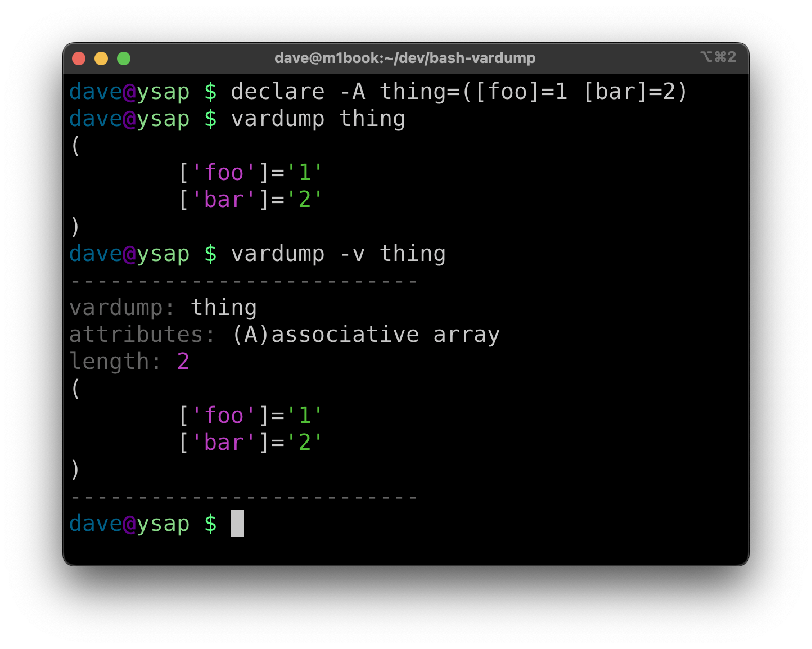

bash-vardump
============

Bash library for pretty-printing a variable given by name.

This was inspired by `util.inspect` in Node.js, `p` in or `pp` in ruby,
`var_dump` in php, etc.  This is intended for developers to use for debugging -
this should not be parsed by a machine nor should the output format be
considered stable.



WARNING! This library is intended for a developer to use when debugging using
known variable names - it's not recommended to give `vardump` variable names
that were taken from user input.

Usage
-----

Copy [vardump.bash](/vardump.bash) into your project, source it, and then use
the defined `vardump` function:

``` bash
#!/usr/bin/env bash

. ./vardump

declare -A thing=([foo]=1 [bar]=2)

vardump thing
```

Results in:

```
(
	['foo']='1'
	['bar']='2'
)
```

Options
-------

    vardump [-C always|never|auto] [-v] <varname>

- `-C <always|never|auto>` Enable or disable color output, default is `auto`
- `-v` Verbose output


License
-------

MIT License
